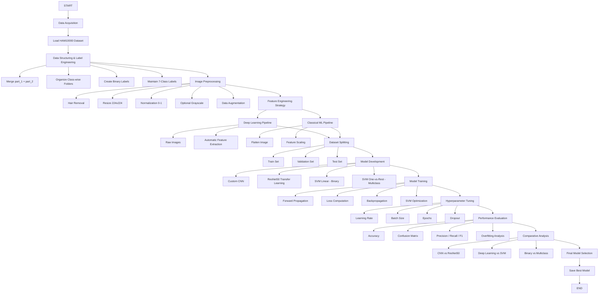

# Skin-Cancer-Classification
# Early detection of skin cancer significantly increases survival rates. This project demonstrates how AI can assist dermatologists by providing fast, automated, and reliable preliminary screening.

# FLOWCHART

